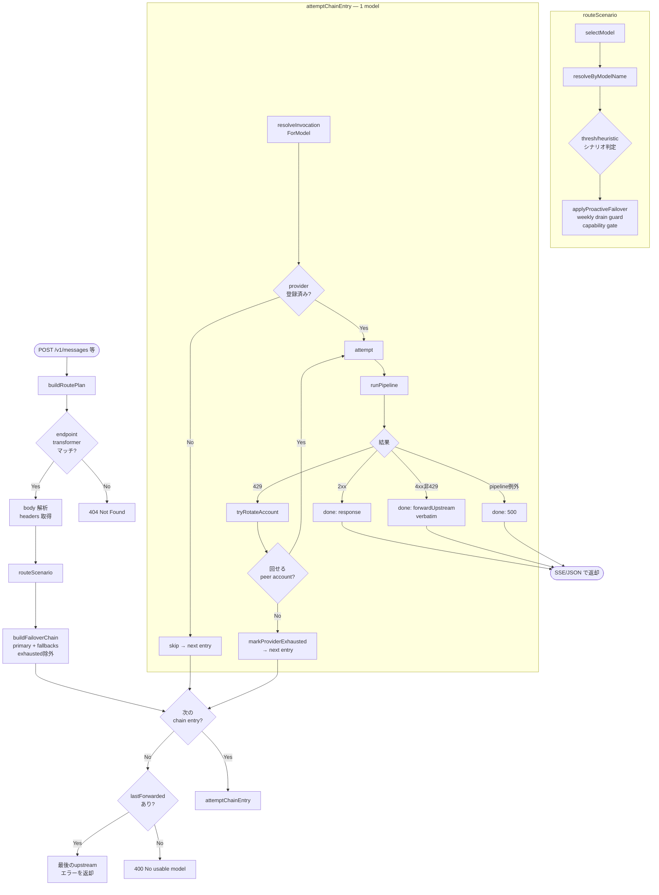
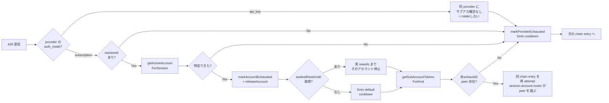
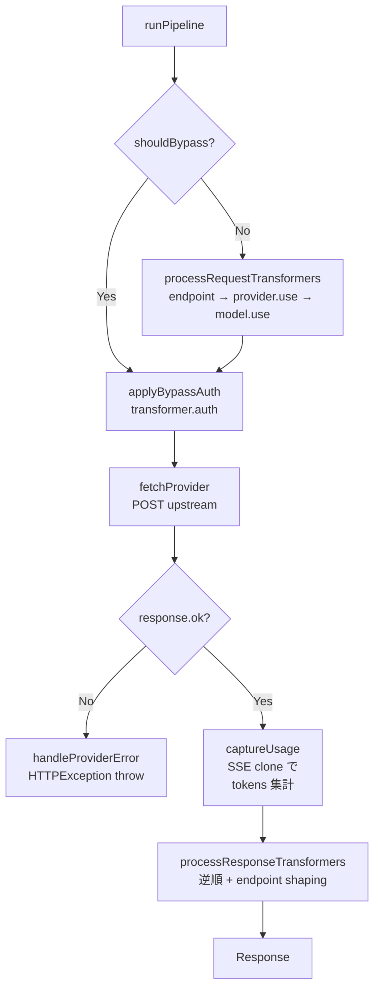

# /v1/* リクエスト処理フロー

## 目的

`POST /v1/*` で Claude Code（または互換クライアント）から入ってきたリクエストが、scenario routing → failover chain → upstream provider 呼び出しまでどう流れるかを可視化する。
特に **multi-account subscription での 429 ローテーション** と **provider 未登録時のスキップ** を取りこぼさないこと。

実装は以下に分散している:

- `src/api/v1/route.ts` — HTTP ハンドラ / chain ループ
- `src/api/v1/route-plan.ts` — `buildRoutePlan`（リクエストごとに1回）
- `src/api/v1/candidate-chain.ts` — `buildFailoverChain`（試す候補の順序）
- `src/api/v1/invocation.ts` — `resolveInvocationForModel`（候補1件 → 実行可能な invocation）
- `src/api/v1/chain-failover.ts` — `attemptChainEntry` / `tryRotateAccount`
- `src/llms/scenario-router.ts` — `routeScenario` / `selectModel` / `applyProactiveFailover`
- `src/llms/pipeline.ts` — `runPipeline` / `handleProviderError`

## 全体フロー

## 429 のときの分岐

`attemptChainEntry` 内のループで起こる、subscription multi-account 対応のローテーション。

ローテーションは 1 chain entry あたり最大 `MAX_ACCOUNT_ROTATIONS = 10` 回までで打ち切る（防御的キャップ）。

## pipeline 内部

`handleProviderError` がスローする `HTTPException` の message は
`Error from provider(<name>,<model>: <status>): <rawBody>` 固定形式。
`v1/route.ts` 側の `forwardUpstreamError` が `PROVIDER_ERR_RE` で
逆パースして upstream の生 body を verbatim 返す。

## fallback の制約 (subscription only ユーザ向け)

`Router.fallbacks` は二段ゲートで保護されている:

| ゲート | 効果 | 防御層 |
|--------|------|--------|
| **auth_mode gate** | primary と異なる auth_mode の fallback を除外 (subscription→api_key の意図しない流出を防ぐ) | `buildFailoverChain` |
| **same-provider gate** | primary と同じ provider の fallback を除外 (5h/weekly quota は account 単位で全 model 共通なので、同 provider 別 model に逃げても無意味) | UI dropdown / `applyUiConfig` 保存時 / `buildFailoverChain` 実行時 |

| 場面 | 挙動 |
|------|------|
| bare 名 `claude-opus-4-8` を受信 | `resolveByModelName` は **subscription provider を先に走査** し、見つかればそこに解決。subscription が同じ model を持っていれば api_key の `anthropic` には落ちない。 |
| primary が subscription で 429 | `buildFailoverChain` が **同 auth_mode かつ別 provider** の fallback だけ残す。subscription primary なら api_key fallback も同 provider 別 model も chain から除外される。 |
| primary が subscription で 429、別 provider の subscription fallback なし | チェーンは primary 1 件のみ。`tryRotateAccount` で peer サブアカへ回って終了、回せなければ 429 を verbatim 返却。 |
| primary が api_key で 429 | 同 auth_mode (api_key) かつ別 provider の fallback を順に試す。 |
| 「サブスク 5h 枯渇したら api_key にフォールバック」を **明示的に** したい | api_key を別 scenario slot の primary として設定し、Claude Code 側で scenario tag (or `output_config.effort`) を切り替える。同一 scenario の `fallbacks` には混在させない。 |

## 代表シナリオ早見表

| # | 状況 | 流れ |
|---|------|------|
| 1 | claude-code (sub) `claude-sonnet-4-6` で正常応答 | `selectModel` → `attemptChainEntry` → 2xx → SSE 返却 |
| 2 | 同上で **5h 窓 429**、サブアカ 3 つあり 1 つだけ枯渇 | 429 → `tryRotateAccount` で当該アカ exhaust → 同 entry 再試行 → peer アカで成功 |
| 3 | 全サブアカが 5h 枯渇 | 429 → 全アカ exhaust → `markProviderExhausted` → 次 fallback (例 `gemini,gemini-2.5-pro`) |
| 4 | weekly 7d 窓が **proactive** に target 超え | `applyProactiveFailover` が primary を捨てて先に fallback へ。`markProviderExhausted` の resetAt は weekly reset 時刻 |
| 5 | model 名 bare で `claude-opus-4-8` 指定 | `resolveByModelName` が subscription を優先し `claude-code,claude-opus-4-8` に解決（subscription が hosts している前提）|
| 6 | 同じ model を api_key の `anthropic` も hosts している | subscription preference により subscription 側が選ばれる。api_key には落ちない |
| 7 | subscription primary が 429、fallback に api_key 混在 | auth_mode gate で api_key fallback は弾かれる。subscription fallback のみ試行 → 全部枯渇なら 429 verbatim |
| 8 | `anthropic` provider が **api_key 未設定** | router がこの provider をスキップ＋registry が warn 出力 |
| 9 | inbound `body.model` に `provider,model` 形式（コンマ）が来た | 入力側のコンマ解釈は廃止。`resolveByModelName` は bare 名一致せず素通り → シナリオルーティング（最終的に `Router.default`）に落ちる。※ `provider,model` は router 出力〜下流の内部表現としては引き続き使用 |
| 10 | upstream が 401/403 (subscription) | `handleProviderError` が「OAuth 期限切れ → CLI 再ログイン」と warn、HTTPException として上に伝播 → 429 ではないので verbatim 返却（rotate なし）|
| 11 | upstream が 400 で `effort` 不一致 | `attempt` 内で `bestSupportedLevel` を読んで effort 差し替え → 同 model に 1 回だけ retry |
| 12 | 全 fallback exhaust | `lastForwarded` (最後の 429 body) を verbatim 返却 |

## 関連する状態ストア

| ストア | 役割 | 失効条件 |
|--------|------|----------|
| `failover-state` (`isProviderExhausted` / `isAccountExhausted`) | provider / sub-account 単位の枯渇フラグ | `markXxxExhausted(until?)` の `until` 時刻 or デフォルト 5min |
| `session-account-router` (`getActiveAccountForSession`) | session ↔ 選択 sub-account の sticky マップ | `releaseAccountForSession` で剥がす |
| `subaccount-usage-store` (`getPerAccountUsage`) | DB の `SubAccountUsage` 行をキャッシュ | 周期 polling で更新 |
| `usage-service` (`getKindWindowHeadroom`) | weekly / 5h ウィンドウのキャッシュ | 周期 polling で更新 |

## ログ整合

- `[provider_response_error]` の `body` は `JSON.parse` で構造化されてから出力されるので
  pino 上はネストされたオブジェクトとして読める（escape まみれの文字列にはならない）。
- `ProviderRegistry.registerFromConfig` は api_key/api_base_url 欠落時に
  `provider 'xxx' skipped — missing required fields: ...` を **warn** で出すので、
  「config 上は居るのに chain walker が見つけられない」状況を即特定できる。
